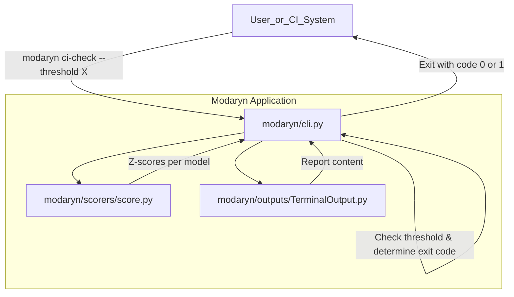
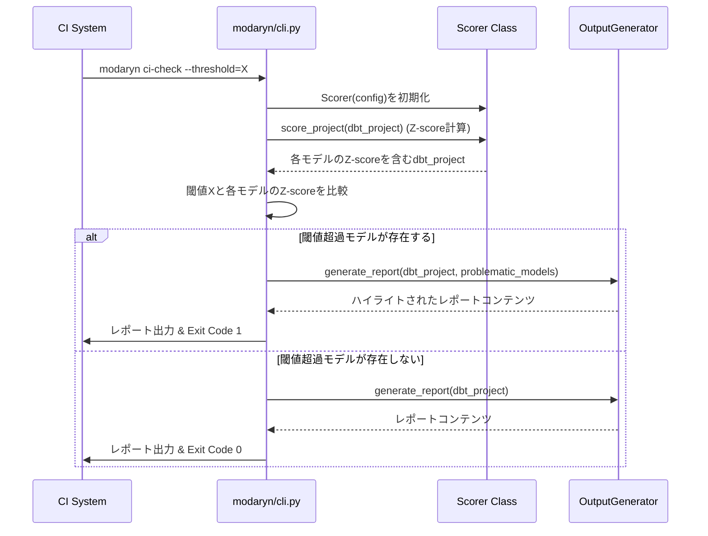

# CI用閾値チェック機能 設計書

## Overview
この機能は、`modaryn` CLIツールにCIワークフロー向けの新しいコマンドを導入します。このコマンドは、dbtモデルの複雑性スコアを定義された閾値と比較し、閾値を超過するモデルがあればCIプロセスを失敗させます。これにより、モデルの品質低下を自動的に検出し、開発パイプラインの早期段階で是正措置を促すことができます。

**目的**: この機能は、CIパイプラインにおいてdbtモデルの品質を自動的に検証するための手段を提供します。
**ユーザー**: CI/CDエンジニア、dbt開発者は、この機能を利用してモデルの健全性を継続的に監視し、品質の高いコードベースを維持します。
**影響 (該当する場合)**: 現在の`modaryn` CLIに新しいコマンドが追加され、CI/CD環境での使用を目的とした新しい振る舞い（閾値チェックとCI失敗）が導入されます。既存のスコアリングおよびレポート生成メカニズムは活用されますが、CIの失敗条件と出力形式が拡張されます。


### Goals
- CIワークフローに統合可能な、閾値ベースのモデル品質チェックコマンドを提供すること。
- モデルスコアが定義された閾値を超過した場合に、CIプロセスを自動的に失敗させること。
- CIの出力において、常にモデルのスコアを表示し、閾値を超過したモデルを明確に特定し表示すること。
- Z-scoreによる閾値設定をサポートすること。

### Non-Goals
- 既存の`modaryn score`コマンドの振る舞いを変更すること。
- `modaryn`のスコアリングロジック自体に新たな変更を加えること（既存のScorerクラスを再利用します）。
- CI以外の目的での複雑なレポート生成機能を提供すること。

## Architecture

### Existing Architecture Analysis
`modaryn`は、`typer`フレームワークをベースとしたPython CLIアプリケーションです。モデルのロード、分析、スコアリング、レポート生成といった明確な責務を持つレイヤー構造を採用しています。
- **CLI (`modaryn/cli.py`)**: アプリケーションのエントリポイントであり、コマンドの定義と引数解析を行います。`Scorer`と`OutputGenerator`をオーケストレーションします。
- **Scoring (`modaryn/scorers/score.py`)**: `Scorer`クラスがモデルの生スコアを計算し、それをZ-scoreに正規化します。
- **Outputs (`modaryn/outputs/`)**: `OutputGenerator`インターフェースを実装するクラス（`TerminalOutput`、`MarkdownOutput`、`HtmlOutput`など）が、スコアリング結果を様々な形式で表示します。

### Architecture Pattern & Boundary Map
この機能は、既存の`modaryn` CLIアプリケーションの機能を拡張するものです。新しいCIコマンドは、既存のスコアリングコンポーネントを再利用し、新しいCI固有のロジックと出力の調整を加えます。



**Architecture Integration**:
- Selected pattern: 既存CLIの拡張（新規コマンド統合）。このパターンは、既存のコンポーネント再利用とCLIのモジュール性を最大化します。
- Domain/feature boundaries: CLIレイヤーに新しいコマンドを追加し、CI固有の閾値チェックロジックを分離します。既存のScorerとOutputGeneratorの責務は変更しません。
- Existing patterns preserved: `typer`によるコマンド定義、`Scorer`によるスコアリング、`OutputGenerator`によるレポート生成のパターンを維持します。
- New components rationale: 主要な新しいコンポーネントはCLI層の新しいコマンドであり、これは閾値チェックロジックとCI統合の責務を担います。
- Steering compliance: モジュール化されたアーキテクチャ原則と責任の分離原則を維持します。

### Technology Stack

| Layer | Choice / Version | Role in Feature | Notes |
|-------|------------------|-----------------|-------|
| CLI | Python 3.9+, Typer | 新しいCIコマンドの定義と実行 | 既存の`modaryn/cli.py`に`app.command()`として追加 |
| Scoring | Python 3.9+, numpy | モデルの複雑性スコア（Z-score）の計算 | `modaryn/scorers/score.py`の`Scorer`クラスを再利用 |
| Output | Python 3.9+ | 結果の表示と閾値超過モデルのハイライト | 既存の`modaryn/outputs/TerminalOutput.py`を拡張または再利用 |
| Runtime | Python | アプリケーション実行環境 | |

## System Flows

### CI閾値チェックのシーケンス


**フローレベルの決定**:
- 新しいCIコマンドは、既存のスコアリングと出力生成ロジックをラップします。
- 閾値チェックはCLIコマンド内部で実行され、どのモデルが閾値を超過したかを特定します。
- 出力生成時には、閾値超過モデルがあればそれを強調表示するための情報が`OutputGenerator`に渡されます。
- CIシステムへの最終的なExit Codeは、閾値チェックの結果に基づいて決定されます。

## Requirements Traceability

| Requirement | Summary | Components | Interfaces | Flows |
|-------------|---------|------------|------------|-------
| 1.1 | `modaryn` が特定のCI用コマンドで実行されたとき、モデルの複雑度を評価する。 | `modaryn/cli.py` (new command) | `Scorer` (existing interface) | CI閾値チェックのシーケンス |
| 1.2 | 通常のスコアコマンドとは異なる方法で動作するCI専用のコマンドを提供する。 | `modaryn/cli.py` (new command) | CLI (user interface) | CI閾値チェックのシーケンス |
| 2.1 | 設定された閾値を超えるモデルが検出されたとき、CIプロセスをエラー状態にする。 | `modaryn/cli.py` (new command) | CLI (exit code) | CI閾値チェックのシーケンス |
| 2.2 | ユーザーが閾値を設定できるメカニズムを提供する。 | `modaryn/cli.py` (new command) | CLI (`--threshold` option) | CI閾値チェックのシーケンス |
| 2.3 | 閾値設定がZスコア形式の場合、Zスコア閾値の指定をサポートする。 | `modaryn/cli.py` (new command) | CLI (`--threshold` option, implicitly Z-score) | CI閾値チェックのシーケンス |
| 3.1 | CIが正常に完了したとき、評価されたすべてのモデルのスコア結果を表示する。 | `modaryn/outputs/TerminalOutput.py` (extended) | `OutputGenerator` | CI閾値チェックのシーケンス |
| 3.2 | CIがエラー状態になったとき、閾値を超過したモデルの詳細情報をCI画面に出力する。 | `modaryn/outputs/TerminalOutput.py` (extended) | `OutputGenerator` | CI閾値チェックのシーケンス |

## Components and Interfaces

### CLI Layer

#### `modaryn/cli.py` (new command: `ci-check`)

| Field | Detail |
|-------|--------|
| Intent | CIワークフローでdbtモデルの複雑性閾値チェックを実行し、結果に基づいてCIの合否を決定する |
| Requirements | 1.1, 1.2, 2.1, 2.2, 2.3, 3.1, 3.2 |
| Owner / Reviewers | |

**Responsibilities & Constraints**
- `typer.Typer`コマンドとして新しい`ci-check`サブコマンドを定義する。
- `--threshold`オプションを受け取り、その値を閾値として使用する。
- `Scorer`クラスを初期化し、プロジェクトのモデルをスコアリングする。
- スコアリング結果（Z-score）を閾値と比較し、閾値を超過するモデルを特定する。
- `OutputGenerator`を利用してレポートを生成し、問題のあるモデルをハイライト表示する。
- 閾値超過モデルが存在する場合は、非ゼロのExit Code（例: `1`）で終了する。
- 閾値超過モデルが存在しない場合は、ゼロのExit Code（例: `0`）で終了する。

**Dependencies**
- Inbound: CIシステムまたはユーザー — コマンド実行 (P0)
- Outbound: `Scorer`クラス — モデルスコアリング (P0)
- Outbound: `OutputGenerator`実装 — レポート生成 (P0)
- External: `typer` — CLIフレームワーク (P0)

**Contracts**: Service [ ] / API [ ] / Event [ ] / Batch [ ] / State [ ]

##### CLI Command Interface
```bash
modaryn ci-check [DBT_PROJECT_PATH] --threshold <float_value> [--format <output_format>] [--output <path>]
```
- **DBT_PROJECT_PATH**: dbtプロジェクトのルートパス。
- **--threshold**: 許容される最大Z-score閾値。この値を超過するモデルがあればCIは失敗する。
- **--format**: 出力フォーマット (`terminal`, `markdown`, `html`)。デフォルトは`terminal`。
- **--output**: レポートを保存するファイルパス。

**Implementation Notes**
- **統合**: 既存の`modaryn` CLIアプリケーションに新しいトップレベルコマンドとして追加されます。`Scorer`および`OutputGenerator`とのインタラクションは既存の`score`コマンドと同様のパターンに従います。
- **検証**: `--threshold`値の妥当性検証（例: 数値であること）が必要です。
- **リスク**: `OutputGenerator`が閾値超過モデルのハイライト表示を直接サポートしていない場合、`modaryn/cli.py`内で出力結果をさらに加工するか、`TerminalOutput`を拡張する必要がある可能性があります。

### Output Layer

#### `modaryn/outputs/terminal.py` (extended)

| Field | Detail |
|-------|--------|
| Intent | CLIコマンドの出力結果をターミナルでユーザーフレンドリーに表示する |
| Requirements | 3.1, 3.2 |
| Owner / Reviewers | |

**Responsibilities & Constraints**
- スコアリングされた全モデルのリストを表示する。
- 閾値を超過したモデルを視覚的に区別して表示する。
- 閾値チェックのサマリー（合格/不合格、閾値超過モデルの数など）を提供する。

**Dependencies**
- Inbound: `modaryn/cli.py` (new command) — レポート生成リクエストと閾値超過モデルの情報 (P0)
- External: `rich` — ターミナルでのリッチな出力 (P0)

**Contracts**: Service [ ] / API [ ] / Event [ ] / Batch [ ] / State [ ]

##### Interface
`TerminalOutput`クラスの`generate_report`メソッドのシグネチャを拡張し、閾値超過モデルのリストを受け取れるようにする可能性があります。
```python
class TerminalOutput(OutputGenerator):
    def generate_report(self, project: DbtProject, problematic_models: List[DbtModel] = None) -> str:
        # ... implementation to highlight problematic_models
```
- **事前条件**: `project`オブジェクトはスコア計算済みであること。
- **事後条件**: フォーマットされた文字列レポートが返されること。

**Implementation Notes**
- **統合**: 既存の`TerminalOutput`クラスを修正し、`problematic_models`リストに基づいて出力形式を変更するロジックを追加します。この変更は`MarkdownOutput`や`HtmlOutput`といった他の出力フォーマットには影響しません。
- **検証**: 閾値超過モデルリストが空の場合でも、レポートが正しく生成されることを確認します。
- **リスク**: `rich`ライブラリでの適切なハイライト表現の設計。

## エラー処理

### エラー戦略
- **CLI引数エラー**: `typer`によって自動的に処理される、または明示的なバリデーションエラーメッセージを表示し、`typer.Exit(code=1)`で終了。
- **閾値超過エラー**: `ci-check`コマンドがモデルの閾値超過を検出した場合、関連するモデル情報とともに詳細なメッセージをターミナルに出力し、`typer.Exit(code=1)`で終了。
- **内部エラー**: 既存の`modaryn`のロギングメカニズムを使用し、トレースバックとともに`typer.Exit(code=1)`で終了。

### エラーカテゴリと応答
- **ユーザーエラー (Invalid Threshold)**: `--threshold`に無効な値が指定された場合、`modaryn`はエラーメッセージを表示し終了します。
- **ビジネスロジックエラー (Threshold Exceeded)**: 1つ以上のモデルが閾値を超過した場合、`modaryn`は閾値を超過したモデルのリストとスコアを表示し、CIを失敗させます。

## テスト戦略

### Default sections (adapt names/sections to fit the domain)
- **単体テスト**:
    - 新しい`ci-check`コマンドの引数解析とバリデーション。
    - `ci-check`コマンド内での閾値比較ロジック。
    - `TerminalOutput`が閾値超過モデルを正しくハイライト表示すること。
- **結合テスト**:
    - `modaryn ci-check`コマンドが実際のdbtプロジェクトに対して実行され、閾値超過に応じて正しいExit Codeを返すこと。
    - 閾値超過がある場合とない場合のターミナル出力内容の検証。
    - 閾値と`--format`オプションの組み合わせテスト。
- **E2E/UIテスト**:
    - 実際のCI環境（例: GitHub Actionsのワークフロー）での`modaryn ci-check`コマンドの実行と結果の検証。

## 参照情報
- [modaryn/scorers/score.py]: Scorerクラスの実装詳細。Z-scoreの計算方法についてはこのファイルを参照。
- [modaryn/outputs/terminal.py]: TerminalOutputクラスの実装詳細。レポート生成ロジックとrichライブラリの使用方法についてはこのファイルを参照。
