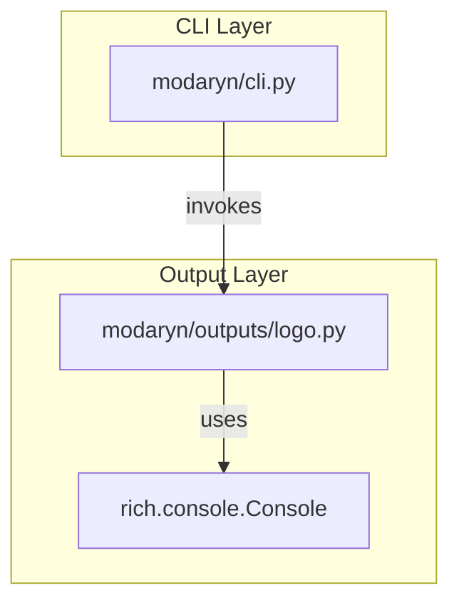

# 技術設計書

## 概要
この機能は、`modaryn` CLIが引数やオプションなしで実行されたときに、ブランドのASCIIアートロゴを表示する機能を提供する。これにより、ユーザーはツールが正しくインストールされ、実行可能であることを視覚的に確認できる。既存のCLIエントリーポイントへの単純な機能追加であり、主要なロジックには影響しない。

### ゴール
- 引数なしで`modaryn`コマンドが実行された場合に、ASCIIロゴを表示する。
- ロゴ表示は既存のコマンドの機能を妨げない。

### ノンゴール
- ロゴの動的な生成やカスタマイズ機能。
- ロゴ以外の追加情報の表示。

## アーキテクチャ

### 既存アーキテクチャの分析
`modaryn`は`typer`を利用した単一のCLIアプリケーションである。エントリーポイントは`modaryn/cli.py`にあり、`@app.callback()`を持つ`main`関数が初期処理を担う。この既存の構造を拡張して、引数がない場合の処理分岐を追加する。

### アーキテクチャパターンと境界マップ
この変更は既存のCLIレイヤー内での変更に限定される。新しいコンポーネントは表示ロジックの一部として`outputs`レイヤーに追加され、プロジェクトの構造原則を維持する。



**アーキテクチャ統合**:
- **選択したパターン**: 既存のCLIコールバックパターンの拡張。
- **ドメイン/機能の境界**: `cli.py`が呼び出しの判断を行い、`outputs/logo.py`が表示を担当することで、関心を分離する。
- **ステアリングへの準拠**: `outputs`ディレクトリに表示関連のロジックを配置する既存のパターンに従う。

## 要求事項トレーサビリティ

| 要求事項 | 概要 | コンポーネント |
|---|---|---|
| 1 | コマンド単体実行時のロゴ表示 | `modaryn.cli.py` |
| 2 | ロゴのフォーマットと表示品質 | `modaryn.outputs.logo.py` |

## コンポーネントとインターフェース

### CLIレイヤー

#### `modaryn.cli.py` (修正)

| フィールド | 詳細 |
|---|---|
| 意図 | CLIのエントリーポイントとして機能し、引数なしの呼び出しを検知してロゴ表示機能を呼び出す。 |
| 要求事項 | 1 |

**依存関係**:
- **アウトバウンド**: `modaryn.outputs.logo.display_logo` — ロゴ表示のため (クリティカリティ: P0)

**コントラクト**: サービスインターフェース

##### サービスインターフェース
`typer`のコールバック機構を修正する。

```python
# 修正前
app = typer.Typer(help="...")

@app.callback()
def main():
    ...
```

```python
# 修正後
import typer
from modaryn.outputs.logo import display_logo

app = typer.Typer(help="...", invoke_without_command=True)

@app.callback()
def main(ctx: typer.Context):
    """
    modaryn analyzes dbt projects to score model complexity and structural importance.
    """
    if ctx.invoked_subcommand is None:
        display_logo()
        raise typer.Exit()
```

### Outputレイヤー

#### `modaryn.outputs.logo.py` (新規)

| フィールド | 詳細 |
|---|---|
| 意図 | ASCIIロゴの定義と、それをコンソールに表示する責務を担う。 |
| 要求事項 | 2 |

**依存関係**:
- **インバウンド**: `modaryn.cli.py` — ロゴ表示のため (クリティカリティ: P0)
- **外部**: `rich.console.Console` — コンソールへの出力のため (クリティカリティ: P0)

**コントラクト**: サービスインターフェース

##### サービスインターフェース
```python
from rich.console import Console

LOGO = """
 (ここにASCIIアートロゴが入る) 
"""

def display_logo():
    """ASCIIアートロゴをコンソールに表示する。"""
    console = Console()
    console.print(LOGO, style="bold blue") # スタイルは仮
```
- **事前条件**: なし
- **事後条件**: ロゴが標準出力に表示される。

**実装に関する注意**:
- **ロゴの内容**: `modaryn`という小文字を含み、ターミナルで崩れないように設計されたASCIIアートを`LOGO`定数に定義する。
- **表示品質**: `rich`ライブラリを使用することで、ターミナル幅に応じた表示崩れの防止や、色の適用が容易になる。

## エラーハンドリング
`typer.Exit()`を呼び出すことで、ロゴ表示後に他のコマンドが実行されることなく、正常にプロセスを終了させる。

## テスト戦略
- **ユニットテスト**: `display_logo`関数が、与えられた`Console`オブジェクトの`print`メソッドを特定のロゴ文字列で呼び出すことを確認する。
- **統合テスト**: `typer`のテストランナー（または`subprocess`）を使用して、`modaryn`コマンドを引数なしで実行した際に、標準出力にロゴが含まれていることをアサートする。
