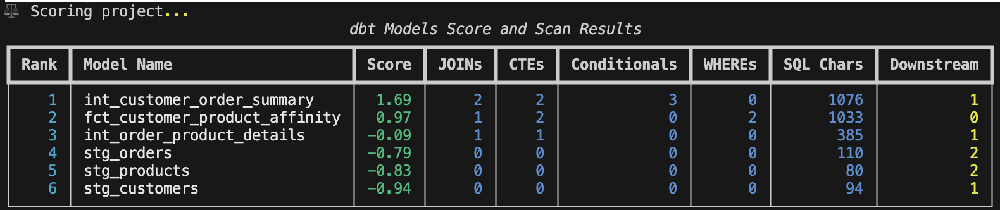
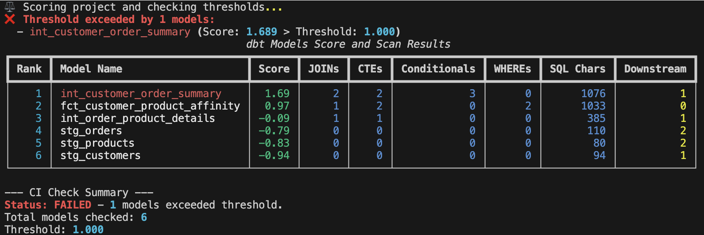

### 概要
`modaryn` は、dbt プロジェクトを分析するための Python 製 CLI ツールです。各モデルを以下の3つの観点でスコアリングし、高リスク・高影響なモデルを特定するのに役立ちます。

- **Complexity（複雑度）** — SQL メトリクス（JOIN 数、CTE 数、条件分岐数、WHERE 句数、文字数）
- **Importance（重要度）** — 構造メトリクス（下流モデル数、下流カラム参照数）
- **Quality（品質）** — テストカバレッジ（テスト数、カラムカバレッジ %）

**最終スコア:** `raw_score = complexity_score + importance_score - quality_score`（高いほどリスクが高い）

SQL 方言は `manifest.json` から自動検出されます。カラムレベルの系譜は `sqlglot` を使ってトレースされ、下流への影響を算出します。

### インストール
```bash
uv pip install git+https://github.com/yujikawa/modaryn.git
```

### 使い方

#### `score` コマンド
すべての dbt モデルを分析・スコアリングし、スキャンとスコアを組み合わせたレポートを表示します。

```bash
modaryn score --project-path . --apply-zscore --format html --output report.html
```

| オプション | 短縮形 | 説明 | デフォルト |
|------------|--------|------|------------|
| `--project-path` | `-p` | dbt プロジェクトディレクトリへのパス | `.` |
| `--dialect` | `-d` | SQL 方言（`bigquery`, `snowflake`, `duckdb` など）。省略時は `manifest.json` から自動検出。 | 自動 |
| `--config` | `-c` | カスタム重み設定 YAML ファイルへのパス | `None` |
| `--apply-zscore` | `-z` | スコアに Z スコア正規化を適用する | `False` |
| `--format` | `-f` | 出力形式: `terminal`, `markdown`, `html` | `terminal` |
| `--output` | `-o` | 出力ファイルの書き込み先パス | `None` |
| `--select` | `-s` | セレクタでモデルを絞り込む（複数指定可、OR 結合） | `None` |
| `--verbose` | `-v` | 詳細なワーニングを表示する（SQL 未発見、カラムスキップ等） | `False` |

**`--select` セレクタの書き方:**
```bash
# モデル名グロブ
modaryn score --project-path . --select "fct_*"

# パスプレフィックス
modaryn score --project-path . --select path:marts/finance

# dbt タグ
modaryn score --project-path . --select tag:daily

# 複数指定（OR 結合）
modaryn score --project-path . --select path:marts/customer --select path:marts/finance
```

---

#### `ci-check` コマンド
CI/CD パイプライン向けに、モデルのスコアが閾値を超えていないかチェックします。閾値を超えたモデルがある場合は終了コード `1`、なければ `0` で終了します。

```bash
modaryn ci-check --project-path . --threshold 20.0 --apply-zscore
```

| オプション | 短縮形 | 説明 | デフォルト |
|------------|--------|------|------------|
| `--project-path` | `-p` | dbt プロジェクトディレクトリへのパス | `.` |
| `--threshold` | `-t` | 許容する最大スコア（**必須**） | — |
| `--dialect` | `-d` | SQL 方言。省略時は自動検出。 | 自動 |
| `--config` | `-c` | カスタム重み設定 YAML ファイルへのパス | `None` |
| `--apply-zscore` | `-z` | raw スコアの代わりに Z スコアで閾値チェック | `False` |
| `--format` | `-f` | 出力形式: `terminal`, `markdown`, `html` | `terminal` |
| `--output` | `-o` | 出力ファイルの書き込み先パス | `None` |
| `--select` | `-s` | セレクタでモデルを絞り込む（複数指定可、OR 結合） | `None` |
| `--verbose` | `-v` | 詳細なワーニングを表示する | `False` |

---

#### `impact` コマンド
特定カラムへの変更が下流のどのカラムに影響するかを BFS でトレースします（カラムレベル影響分析）。

```bash
modaryn impact --project-path . --model fct_orders --column order_id
```

| オプション | 短縮形 | 説明 | デフォルト |
|------------|--------|------|------------|
| `--project-path` | `-p` | dbt プロジェクトディレクトリへのパス | `.` |
| `--model` | `-m` | 起点となるモデル名（**必須**） | — |
| `--column` | `-c` | 起点となるカラム名（**必須**） | — |
| `--dialect` | `-d` | SQL 方言。省略時は自動検出。 | 自動 |
| `--select` | `-s` | セレクタでモデルを絞り込む（系譜のスコープを制限） | `None` |
| `--verbose` | `-v` | 詳細なワーニングを表示する | `False` |

---

### コンパイル済み SQL がない場合（N/A 表示）

複雑度メトリクスは `target/compiled/` のコンパイル済み SQL が必要です。`dbt compile` を実行していない、またはコンパイルに失敗したモデルは、複雑度関連の列が `N/A` になります。レポートの末尾にサマリーが表示されます。`--verbose` を使うと対象モデルの詳細が確認できます。

```
⚠ 3 model(s) show N/A for complexity columns because compiled SQL was not found.
Run `dbt compile` to enable full analysis: model_a, model_b, model_c
```

---

### レポートの列説明と算出ロジック

#### 1. SQL 複雑度メトリクス

| メトリクス | 算出方法 | 例 |
|------------|----------|----|
| **JOINs** | SQL 内のすべての `JOIN` 句の数 | `JOIN`, `LEFT JOIN`, `CROSS JOIN` それぞれ 1 |
| **CTEs** | 定義されたすべての CTE の数 | `WITH a AS (...), b AS (...)` = 2 |
| **Conditionals** | `IF` 式の数（`CASE` の各 `WHEN` ブランチを個別にカウント） | `CASE WHEN ... WHEN ... END` の 2 分岐 = 2 |
| **WHEREs** | `WHERE` 句の数（サブクエリ内を含む） | メイン + サブクエリ内の `WHERE` = 2 |
| **SQL Chars** | コンパイル済み SQL の総文字数 | — |

#### 2. 構造的重要度メトリクス

| メトリクス | 算出方法 | 例 |
|------------|----------|----|
| **Downstream** | このモデルを直接参照している dbt モデルの数 | モデル B と C がモデル A を参照 → **2** |
| **Col. Down** | このモデルのカラムを参照している下流カラムの延べ数 | B の `col1` と `col2` が A の `id` を参照 → **2** |

**`Col. Down` の具体例:**
モデル A に `user_id` カラムがあり、以下の参照がある場合:
- モデル B が `user_id` → `b_user_id` を計算 (+1)
- モデル C が `user_id` → `c_user_id` と `creator_id` の 2 つを計算 (+2)
- **モデル A の `Col. Down` 合計** = 1 + 2 = **3**

#### 3. 品質メトリクス

| メトリクス | 算出方法 | 例 |
|------------|----------|----|
| **Tests** | モデルに設定されたすべての dbt テストの数 | 4 つのカラムテスト → **4** |
| **Coverage (%)** | 少なくとも 1 つのテストが設定されているカラムの割合 | 10 カラム中 8 カラムにテスト → **80%** |

---

### スコア計算式

1. **複雑度スコア** = `(JOINs × w1) + (CTEs × w2) + (Cond. × w3) + (WHEREs × w4) + (Chars × w5)`
2. **重要度スコア** = `(Downstream Models × w6) + (Col. Down × w7)`
3. **品質スコア** = `(Tests × w8) + (Coverage % × w9)`

**Raw Score（生スコア）** = `複雑度スコア + 重要度スコア − 品質スコア`（最小値 0）

#### Z スコア正規化
`--apply-zscore` を使用すると、生スコアをプロジェクト全体の分布で標準化します。
`Z-Score = (Raw Score − 平均) / 標準偏差`

---

### カスタム重み設定

`--config` フラグで YAML ファイルを渡すと、各メトリクスの重みを上書きできます。

```yaml
sql_complexity:
  join_count: 2.0
  cte_count: 1.5
  conditional_count: 1.0
  where_count: 0.5
  sql_char_count: 0.01

importance:
  downstream_model_count: 1.0

quality:
  test_count: 0.5
  column_coverage: 1.0
```

存在しないセクションやキーが含まれている場合は、実行時にワーニングとして表示されます。

---




