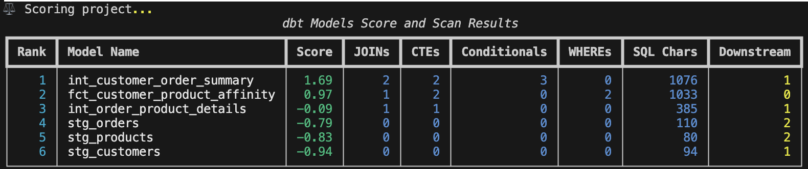
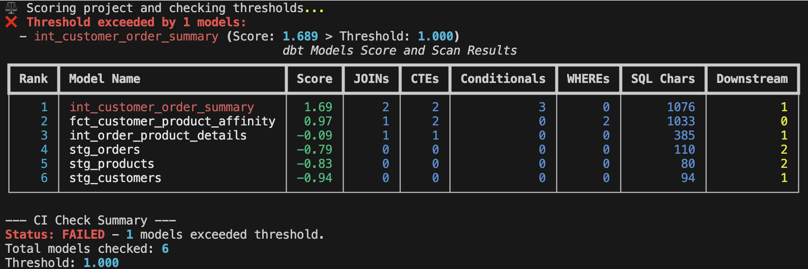

# modaryn

modaryn analyzes dbt projects to score model complexity and structural importance,
helping teams identify high-risk and high-impact data models.

### Overview
`modaryn` is a Python-based Command Line Interface (CLI) tool designed to analyze dbt (data build tool) projects. Its primary purpose is to score the complexity and structural importance of dbt models, helping data teams identify high-risk and high-impact data models within their projects. It now extracts detailed complexity metrics such as `JOIN` counts, CTE counts, conditional statements (`CASE`, `IF`), `WHERE` clause counts, and SQL character length, and ranks models using Z-scores.

### Installation
The project uses `uv` for dependency management. To install dependencies, run:
```bash
uv pip install git+https://github.com/yujikawa/modaryn.git
```

### Usage
The `modaryn` CLI provides the following commands:

#### `score` command
Analyzes and scores dbt models based on complexity and importance, displaying combined scan and score information.
```bash
modaryn score --project-path . --dialect bigquery --config custom_weights.yml --format html --output modaryn_report.html
```

##### Custom Weights Configuration (`custom_weights.yml`)
You can customize the weights used for calculating complexity and importance scores by providing a YAML file via the `--config` flag. This allows you to fine-tune the scoring mechanism to better suit your project's needs.

The structure of the `custom_weights.yml` should mirror the default configuration found in `modaryn/config/default.yml`. Here's an example based on the default:

```yaml
sql_complexity:
  join_count: 2.0
  cte_count: 1.5
  conditional_count: 1.0
  where_count: 0.5
  sql_char_count: 0.01

importance:
  downstream_model_count: 1.0
```
- `sql_complexity`: Contains weights for various SQL complexity metrics. Adjusting these values will change how much each factor contributes to the overall complexity score.
- `importance`: Contains weights for importance metrics. Currently, `downstream_model_count` is used to weigh models based on how many other models depend on them.

Adjust these values to emphasize or de-emphasize certain aspects of complexity or importance.



#### `ci-check` command
Checks dbt model complexity against a defined Z-score threshold for CI pipelines. Exits with code 1 if any model's score exceeds the threshold, 0 otherwise. This command is designed for automated quality gates in your CI/CD workflows.

```bash
modaryn ci-check --project-path . --threshold 1.0 --format terminal
```
- `--project-path`: Path to the dbt project directory.
- `--threshold`: The maximum allowed Z-score for models. CI will fail if any model exceeds this.
- `--format`: Output format (`terminal`, `markdown`, `html`). Defaults to `terminal`.

