# Sample dbt Project for Modaryn Analysis

This sample dbt project serves as a comprehensive example for demonstrating the capabilities of `modaryn`, a tool designed to analyze and score dbt models based on their complexity and structural importance. The project is structured across multiple business domains, including Core operations, Finance, and Marketing, featuring a variety of staging (stg), intermediate (int), fact (fct), and dimension (dim) models.

The expanded dataset aims to showcase how `modaryn` can provide insights into a larger, more interconnected dbt project, helping identify high-risk areas, understand data flow, and improve model design.

## Project Structure Overview:

### Core Domain
Focuses on fundamental business operations like customer data, orders, and products.
-   **Staging Models (`stg_*`)**: Directly from raw sources (`customers`, `orders`, `products`, `shipping`, `website_traffic`).
-   **Intermediate Models (`int_*`)**: Data transformations and aggregations (`int_customer_order_summary`, `int_order_product_details`, `int_daily_sales`, `int_customer_daily_summary`, `int_product_daily_performance`, `int_order_shipping_details`).
-   **Fact Models (`fct_*`)**: Core business events (`fct_customer_product_affinity`, `fct_customer_transactions`).
-   **Dimension Models (`dim_*`)**: Conformed dimensions (`dim_dates`).

### Finance Domain
Covers financial aspects such as revenue, expenses, profit/loss, and cash flow.
-   **Intermediate Models (`int_*`)**: Financial calculations (`int_monthly_revenue`, `int_product_costs`, `int_daily_expenses`).
-   **Fact Models (`fct_*`)**: Financial reporting (`fct_profit_and_loss_statement`, `fct_gross_margin_analysis`, `fct_cash_flow_statement`).
-   **Dimension Models (`dim_*`)**: Financial entities (`dim_accounts`, `dim_vendors`).

### Marketing Domain
Dedicated to marketing performance, customer segmentation, and attribution.
-   **Intermediate Models (`int_*`)**: Marketing data processing (`int_campaign_performance`, `int_customer_demographics`).
-   **Fact Models (`fct_*`)**: Marketing analytics (`fct_daily_customer_acquisition`, `fct_customer_retention`, `fct_marketing_attribution`, `fct_customer_segmentation`).
-   **Dimension Models (`dim_*`)**: Marketing entities (`dim_channels`, `dim_products`).

## ER Diagram (Conceptual)

```mermaid
erDiagram
    CUSTOMER ||--o{ ORDER : places
    PRODUCT ||--o{ ORDER : contains

    ORDER ||--|{ stg_orders : "1 to M"
    CUSTOMER ||--|{ stg_customers : "1 to M"
    PRODUCT ||--|{ stg_products : "1 to M"
    stg_shipping ||--|{ stg_orders : "1 to 1"
    stg_website_traffic ||--|{ dim_dates : "M to 1"

    stg_customers }|--|| int_customer_order_summary : "has"
    stg_orders }|--|| int_customer_order_summary : "summarizes"
    stg_products }|--|| int_order_product_details : "details"
    stg_orders }|--|| int_order_product_details : "details"

    int_customer_order_summary }|--|| fct_customer_product_affinity : "affects"
    int_order_product_details }|--|| fct_customer_product_affinity : "affects"

    stg_orders }|--|| int_daily_sales : "aggregates"
    stg_orders }|--|| fct_daily_customer_acquisition : "tracks"

    int_daily_sales }|--|| int_monthly_revenue : "aggregates"
    int_monthly_revenue }|--|| fct_profit_and_loss_statement : "calculates"
    int_daily_sales }|--|| fct_profit_and_loss_statement : "calculates"

    fct_customer_transactions }|--|| int_product_costs : "uses"
    fct_customer_transactions }|--|| fct_gross_margin_analysis : "analyzes"
    int_product_costs }|--|| fct_gross_margin_analysis : "uses"
    int_daily_sales }|--|| int_daily_expenses : "derives"
    fct_profit_and_loss_statement }|--|| fct_cash_flow_statement : "derives"

    stg_customers }|--|| int_customer_demographics : "enriches"
    int_campaign_performance }|--|| fct_marketing_attribution : "attributes"
    stg_orders }|--|| fct_marketing_attribution : "attributes"
    stg_products }|--|| dim_products : "enriches"

    stg_customers }|--|| fct_customer_segmentation : "segments"
    stg_orders }|--|| fct_customer_segmentation : "segments"

    stg_orders }|--|| int_customer_daily_summary : "summarizes"
    stg_orders }|--|| int_product_daily_performance : "tracks"
    stg_orders }|--|| fct_customer_transactions : "generates"
    stg_shipping }|--|| int_order_shipping_details : "enriches"
    stg_orders }|--|| int_order_shipping_details : "enriches"

    int_customer_daily_summary ||--o{ fct_customer_retention : "measures"
    stg_orders ||--o{ fct_customer_retention : "measures"

    dim_accounts ||--o{ fct_profit_and_loss_statement : "categorizes"
    dim_vendors ||--o{ int_daily_expenses : "categorizes"
    dim_channels ||--o{ int_campaign_performance : "categorizes"
```

